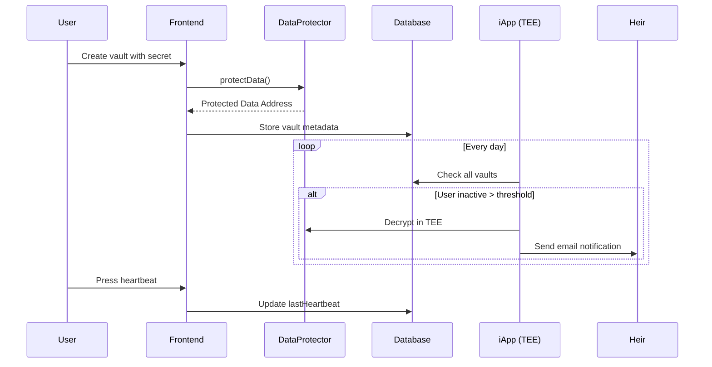

# De-Inherit 🏛️

> Secure your digital legacy. A privacy-preserving inheritance platform powered by iExec TEE technology.


## Overview

**De-Inherit** is a dead man's switch for your digital secrets. Store encrypted wills, private keys, or sensitive messages that automatically release to your designated heir after a period of inactivity.

### The Problem

What happens to your digital assets when you die? Private keys, passwords, and important messages are lost forever—or worse, exposed to the wrong people.

### The Solution

- **Encrypt** your secrets using iExec DataProtector (TEE)
- **Set a timer** (e.g., 30 days of inactivity)
- **Press the heartbeat** periodically to prove you're alive
- **Automatic release** to your heir when you go silent

## Features

- 🔐 **TEE-Encrypted Secrets** - Your data never leaves the secure enclave unencrypted
- ❤️ **Dead Man's Switch** - Configurable inactivity threshold (1-365 days)
- 📧 **Heir Notification** - Automatic email when vault is released
- 👻 **Ghost Mode** - Auto-heartbeat based on on-chain activity (coming soon)
- ⚡ **Bulk Processing** - Efficient batch processing saves 98% on gas

## Tech Stack

- **Frontend**: Next.js 14, Tailwind CSS, Framer Motion
- **Database**: Neon PostgreSQL + Prisma
- **Privacy**: iExec DataProtector SDK
- **Compute**: iExec iApp (Node.js TEE)
- **Auth**: Reown AppKit (WalletConnect)
- **Network**: Arbitrum Sepolia

## Quick Start

### Prerequisites

- Node.js 18+
- npm or yarn
- MetaMask or WalletConnect-compatible wallet
- RLC tokens on Arbitrum Sepolia ([Faucet](https://explorer.iex.ec/arbitrum-sepolia-testnet/faucet))

### Installation

```bash
# Clone the repository
git clone https://github.com/yourusername/de-inherit.git
cd de-inherit

# Install dependencies
npm install

# Set up environment variables
cp .env.local.example .env.local
# Edit .env.local with your values

# Set up database
npx prisma db push

# Run development server
npm run dev
```

### Environment Variables

```env
# Database (Neon PostgreSQL)
DATABASE_URL="postgresql://..."

# Reown (WalletConnect)
NEXT_PUBLIC_REOWN_PROJECT_ID="your_project_id"

# iExec
NEXT_PUBLIC_IAPP_ADDRESS="0x..."
NEXT_PUBLIC_WORKERPOOL_ADDRESS="0xB967057a21dc6A66A29721d96b8Aa7454B7c383F"
```

## Project Structure

```
de-inherit/
├── src/
│   ├── app/
│   │   ├── page.tsx              # Landing page
│   │   ├── vault/page.tsx        # Create vault wizard
│   │   ├── dashboard/page.tsx    # User dashboard
│   │   └── api/
│   │       ├── vault/            # Vault CRUD
│   │       ├── heartbeat/        # Update heartbeat
│   │       └── check-pulse/      # Check if dead
│   ├── components/
│   │   ├── HeartbeatButton.tsx   # The signature UI element
│   │   └── Navigation.tsx
│   └── lib/
│       ├── prisma.ts
│       └── dataprotector.ts
├── iapp/                          # iExec TEE application
│   └── src/app.js
├── prisma/
│   └── schema.prisma
└── feedback.md                    # iExec tools feedback
```

## How It Works



## Deploying the iApp

```bash
cd iapp

# Install iApp generator
npm install -g @iexec/iapp

# Initialize (if not already)
iapp init

# Test locally
iapp test

# Import wallet
iapp wallet import <your-private-key>

# Deploy to Arbitrum Sepolia
iapp deploy --chain arbitrum-sepolia-testnet
```

## Hackathon Submission

### Deliverables

- ✅ Public GitHub repository
- ✅ Functional frontend with premium UI
- ✅ iExec DataProtector integration
- ✅ iApp with TEE logic
- ✅ feedback.md with tool experience
- ✅ Bulk processing implementation ($300 bonus)

### Demo Video

[Watch the demo](https://youtube.com/...)

1. Set threshold to 1 minute (demo mode)
2. Create vault with test secret
3. Wait 61 seconds
4. iApp processes and releases
5. Heir notification shown

## License

MIT

---

Built with ❤️ for [Hack4Privacy 2026](https://hack4privacy.iex.ec)
